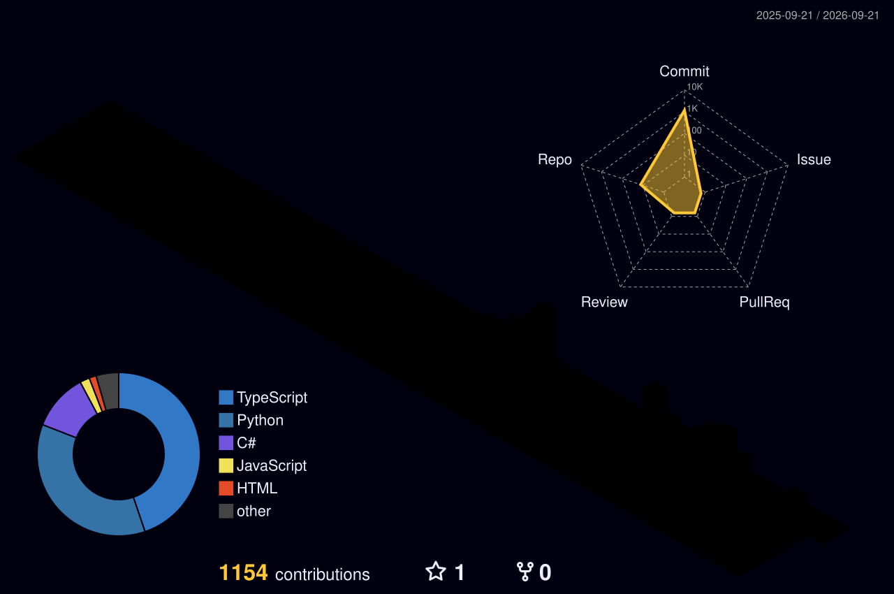

<!-- ────────────────────────────  BANNER  ──────────────────────────── -->
<div align="center">


<a href="https://github.com/Archangel-gabri">
  
</a>

<br/>

<!-- ────────────────────────────  CONTACT  ─────────────────────────── -->
<a href="https://t.me/Castiel68"></a>
<a href="mailto:kubrak15112006@gmail.com"></a>
<a href="https://orcid.org/0009-0003-1553-2982"></a>


</div>

<br/>

<!-- ────────────────────────────  ABOUT  ───────────────────────────── -->

## `~` whoami

I build **LLM-powered systems that run in production** — not notebooks, not demos.

Over the last two years I shipped a multi-node VPN platform serving live users, a CRM with a 53-endpoint
FastAPI backend, and a university-wide records system deployed on real hardware. In parallel I ran a
**process-level benchmark of 12 LLMs across 75 university math problems** and published the full dataset.
The through-line: I take an AI capability and turn it into something people actually log into.

```yaml
role:      AI / LLM Application Engineer  ·  Full-Stack
focus:     multi-agent orchestration · RAG · MCP · agentic tooling
backend:   Python · FastAPI · SQLAlchemy · PostgreSQL · C#/ASP.NET
frontend:  TypeScript · React 18 · Vite · TanStack · Tailwind · Electron
infra:     Linux (Arch/Debian) · Docker · nginx · systemd · Xray/Remnawave
education: Plekhanov REU — Statistics  ·  School 21 (Sber) — Data Science
languages: Russian (native) · English (C2 Proficient, EF SET 89/100)
```

<br/>

<!-- ────────────────────────────  WORK  ────────────────────────────── -->

## `~` Selected work

<table>
<tr>
<td width="50%" valign="top">

### 🛰 HubVPN
**Production VPN platform · live users**

Multi-node VLESS/Xray fleet on a Remnawave control plane — Germany master, Moscow cascade, Finland &
Japan exits. Telegram-first onboarding, provisioning and node lifecycle handled end-to-end by me:
DPI-resistant transport (Vision/XHTTP), TLS, monitoring, backups.

`Xray` `Remnawave` `Linux` `nginx` `Docker`

</td>
<td width="50%" valign="top">

### 📊 LLM University Math Benchmark
**Research · open dataset**

A *process-level* benchmark: 75 university math problems × 12 LLMs, every solution rubric-graded by an
LLM-as-a-judge — scoring the reasoning chain, not just the final answer. Problems, raw model outputs,
prompts, grading rubrics and scoring code are public, in Russian and English.

`Python` `LLM-as-a-judge` `Open dataset`

[**→ Repository**](https://github.com/Archangel-gabri/llm-university-math-benchmark)

</td>
</tr>
<tr>
<td width="50%" valign="top">

### ⛳ Golf Club CRM
**Full-stack SaaS · client-facing** &nbsp;

Booking, membership and billing CRM for a Moscow golf club. 53 REST endpoints on FastAPI +
SQLAlchemy + Pydantic with JWT auth, React 18 / TypeScript / Vite / TanStack Query front end,
deployed behind nginx with TLS.

`FastAPI` `React 18` `TypeScript` `PostgreSQL` `Docker`

</td>
<td width="50%" valign="top">

### 🧭 Argus
**Local-first desktop command center** &nbsp;

Electron app that puts servers, subscriptions, finances and AI-provider quotas in one place. Reads real
usage from provider APIs, tracks spend per model, ships as an AppImage. ~450 tests across a proper
test pyramid.

`Electron` `React` `TypeScript` `SQLite` `Tailwind`

</td>
</tr>
<tr>
<td width="50%" valign="top">

### 🏥 MedSpravki REU
**Deployed institutional system** &nbsp;

Medical-certificate registry for the Physical Education department at Plekhanov REU. ASP.NET Core +
PostgreSQL, with a **local Ollama vision model** reading scanned certificates into structured records.
Running on real hardware, exposed via Tailscale Funnel.

`ASP.NET Core` `PostgreSQL` `Ollama` `Docker`

</td>
<td width="50%" valign="top">

### 🤖 PROEB — AI workspace
**Agentic engineering environment** &nbsp;

My daily driver: a multi-runtime agent workspace wiring Claude Code and Codex together — named
subagents, MCP servers, lifecycle hooks, an async delegation queue and a semantic memory layer over
local embeddings. 470+ commits.

`Claude API` `MCP` `TypeScript` `Python` `Shell`

</td>
</tr>
</table>

<details>
<summary><b>More things I've built</b></summary>

<br/>

| Project | What it is | Stack |
|---|---|---|
| **ProcureCheck** | Automated validation of Russian public-procurement notices for a team — parses tender PDFs and flags rule violations before submission | `Python` `pymupdf` `pdfplumber` |
| **Ghost** | Interview assistant: captures voice and screen, feeds them to an LLM, answers in a glass overlay | `PySide6` `Qt` `LLM APIs` |
| **ds5x** | Linux equivalent of DSX for the DualSense controller — adaptive triggers, lightbar, haptics | `C++` `Linux HID` |
| **PROEB routing** | White-list routing rule compiler that emits client-specific profiles for Happ, Xray, sing-box and mihomo from one ruleset | `Python` |

</details>

<br/>

<!-- ────────────────────────────  EXPERIENCE  ──────────────────────── -->

## `~` Experience & credentials

<table>
<tr><td width="50%" valign="top">

**Applied analytics — De Novo Group**
Inventory audit across a 1C:ERP installation: built the extraction path out of 1C, reconciled stock
against movement history and surfaced the discrepancies. Also ran a two-round credit due-diligence
review of a manufacturing client's financial model.

`1C:ERP` `SQL` `Financial modelling`

</td><td width="50%" valign="top">

**Education**
**Plekhanov Russian University of Economics** — BSc Statistics / Data Science *(in progress)*
**School 21 (Sber)** — Data Science track, peer-to-peer C and algorithms curriculum

**Languages**
Russian — native · **English — C2 Proficient** (EF SET 89/100, 2026)

</td></tr>
</table>

<br/>

<!-- ────────────────────────────  STACK  ───────────────────────────── -->

## `~` Stack

<div align="center">

**Languages & Core**


**Backend & Data**


**Frontend**


**AI / ML**


**Infra & Tooling**


</div>

<br/>

<!-- ────────────────────────────  STATS  ───────────────────────────── -->

## `~` Activity

<div align="center">

<!-- Generated in-repo by .github/workflows/metrics.yml — no third-party uptime dependency -->


<!-- 3D contribution calendar, generated in-repo -->


<!-- Contribution snake, generated in-repo -->
<picture>
  <source media="(prefers-color-scheme: dark)" srcset="https://raw.githubusercontent.com/Archangel-gabri/Archangel-gabri/output/github-snake-dark.svg" />
  <source media="(prefers-color-scheme: light)" srcset="https://raw.githubusercontent.com/Archangel-gabri/Archangel-gabri/output/github-snake.svg" />
  
</picture>

</div>

<br/>

<!-- ────────────────────────────  NOW  ─────────────────────────────── -->

## `~` Currently

- 🔭 Scaling **HubVPN** — DPI-resistant transports and a cleaner multi-node control plane
- 🧪 Redesigning the **LLM math-evaluation study** around a new question: how much of an automatic
  judge's reliability depends on the *language* of the problem, the solution and the rubric
- 🛠 Building agentic tooling — MCP servers, multi-agent orchestration, local-first AI apps
- 🌍 **Open to AI/LLM engineering roles in the EU** — relocation ready

<br/>

<div align="center">


<sub>Reach me on <a href="https://t.me/Castiel68">Telegram</a> · <a href="mailto:kubrak15112006@gmail.com">Email</a></sub>

</div>
